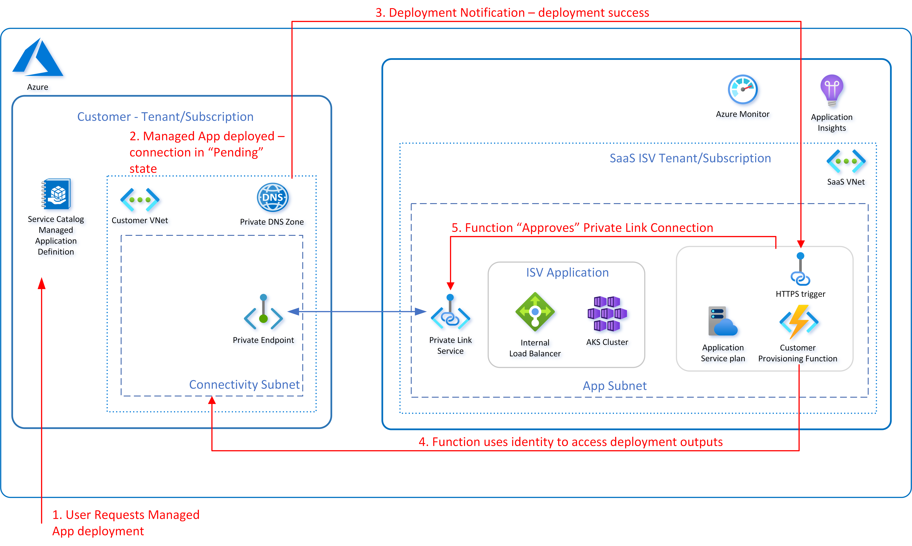

# SaaS Private Connectivity Pattern

## Introduction

This documentation provides guidance on the architecture and deployment of a SaaS Private Connectivity Pattern aimed at supporting the following key features:

- Private connectivity over Azure [Private Link](https://azure.microsoft.com/en-us/services/private-link/) to expose service-hosted APIs.
- Deployment and automated approval of a Private Link connection with an Azure [Managed Application](https://azure.microsoft.com/en-us/services/managed-applications/) deployment.

The solution is intended to be deployed as a Managed Application from either a [service catalog](https://docs.microsoft.com/en-us/azure/azure-resource-manager/managed-applications/overview#service-catalog) or [Azure Marketplace](https://docs.microsoft.com/en-us/azure/azure-resource-manager/managed-applications/overview#marketplace) deployment. The service catalog setup and deployment limits the deployment scope to the subscription in which the service catalog definition is deployed, however the Azure Marketplace allows the solution to be consumed by any subscription. The solution described can be used to enable private connectivity from a customer subscription/tenant to a service provider's solution. To enable connectivity from an existing customer network either VNet peering would be required (recommended) or the use of an existing VNet into which the Managed Application is deployed. In this scenario additional permissions would need to be granted by the customer to allow deployment to the existing VNet scope.

As well as providing an overview of the connectivity pattern there is also a tutorial which provides examples of how to deploy the pattern with a simple application context example.

- [SaaS Private Connectivity Pattern](#saas-private-connectivity-pattern)
  - [Introduction](#introduction)
  - [Overview](#overview)
  - [Deployment](#deployment)
    - [Elements of approval flow](#elements-of-approval-flow)
    - [Webhook endpoint](#webhook-endpoint)
  - [Next steps](#next-steps)

## Overview

The private connectivity pattern leverages standard Azure components to enable private connectivity between a consumer and a SaaS provider where public outbound connectivity from a consumer tenant and subscription is not permitted or supported. This is typical of environments such as those used by financial services customers.

The diagram below provides a high level view of the deployment architecture for this pattern:

The key Azure components used to support this pattern are:

- [Private Endpoint](https://docs.microsoft.com/en-us/azure/private-link/private-endpoint-overview)
- [Private DNS Zone](https://docs.microsoft.com/en-us/azure/dns/private-dns-overview)
- [Private Link service](https://docs.microsoft.com/en-us/azure/private-link/private-link-service-overview)
- [Internal Load Balancer](https://docs.microsoft.com/en-us/azure/load-balancer/load-balancer-overview)

A Private Endpoint is a network interface that connects you privately and securely to a service powered by Azure Private Link. Private Endpoint uses a private IP address from your VNet to provide the connection to the remote service. In the case of the Private Connectivity pattern this is a Private Link Service exposing a set of service APIs.

Private Link Service is the reference to the service provider's service. The service is running behind an internal load balancer and is enabled for Private Link access.

The private DNS Zone is linked to the VNet and allows resolution of the Private Link Service names.

Furthermore, the following component is also used to support the automated approval of the Private Link connection from a Marketplace (or service catalog) deployment:

- [Webhook notification endpoint](https://docs.microsoft.com/en-us/azure/azure-resource-manager/managed-applications/publish-notifications)

In the examples shown in the tutorials an [Azure Function](https://docs.microsoft.com/en-us/azure/azure-functions/functions-overview) has been used to implement the webhook notification endpoint. However, this could also be implemented as a Kubernetes service, a Web App service, or a service running in a VM as long as an endpoint is exposed and reachable through the Internet.

The other components depicted in the deployment architecture diagram are used to support the example SaaS application deployment which provides the APIs that would be made available over the Private Link Service.

## Deployment

The Managed Application deployment can be done from either a [service catalog](./docs/how-to/service-catalog-setup.md) or an [Azure Marketplace](./docs/how-to/marketplace-setup.md) entry. By using a [Managed Application](https://docs.microsoft.com/en-us/azure/azure-resource-manager/managed-applications/overview) the deployment into the customer subscription is then managed by the publisher. The deployment of all the components required to enable private connectivity are contained within the Managed Application, with the exception of the webhook to handle notifications, and any additional VNet peering that is required by the customer to enable access to the Managed Application VNet.

The diagram below illustrates a typical flow when provisioning a Managed Application and automating the approval of the Private Link Connection

### Elements of approval flow

1. Customer will locate the service catalog entry or Azure Marketplace offer and deploy/subscribe to it.
2. This action will result in the creation of a Managed Application in the resource group of the customers choosing.
3. Additionally a managed resource group will be created containing the resources defined in the Managed Application template (_mainTemplate.json_).
4. A notification is sent by the deployment to the webhook and will be handled by the function app which will authorize and approve the Private Link connection. In order to complete this action the identity used by the function app will be used to access the Managed Application deployment details.

In the case of the Private Connectivity pattern it is recommended that an additional authorization is added to Notification and approval process based on the requirements of the service provider. In the tutorials provided this is demonstrated using a pre-shared key stored in the providers database which is provided at ordering time by the consumer and verified by the function app before the connection is approved.

At the end of the deployment process, the selected identities (Users, Groups or Apps/Service principals) will have access to the Managed Application deployment based on the authorization granted. The customer admin will have full control of the Managed Application. However, they will only have read access to the managed resource group unless specific additional authorizations have been granted. In the case of the Private Connectivity pattern these additional permissions are:

- Ability to peer the managed app VNet.
- Ability to link the private DNS zone to a VNet.

### Webhook endpoint

The commercial Marketplace or service catalog calls this endpoint to notify the solution for the events happening on the Marketplace or service catalog side. Those events can be the acceptance of a deployment request, success of the deployment or cancellation of the Managed Application subscription. A publisher provides the URL for this webhook endpoint when registering the offer. In the case of an Azure Function app details of the requests received can be easily logged using Application Insights allowing visibility of the requests being sent. Using a notification webhook also supports notification retries as the Managed Application Notification service expects a 200 OK response from the webhook endpoint to the notification. The notification service will retry if the webhook endpoint returns an HTTP error code greater than or equal to 500, if it returns an error code of 429, or if the endpoint is temporarily unreachable. If the webhook endpoint does not become available within 10 hours, the notification message will be dropped and the retries will stop.

## Next steps

Complete the [three-part tutorial](./docs/tutorial/)
