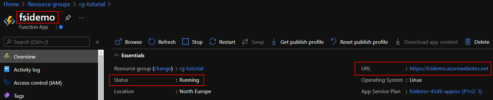

# Tutorial: Deploy an Example Function App as a Notification Endpoint

This tutorial is part one of a three part tutorial series that will configure and deploy and example of the Private Connectivity pattern.

In later tutorials, an example Private Link Service will be created using an AKS cluster and internal Load Balancer and a Managed application will be deployed from the Service Catalog.

## Before you begin

This tutorial assumes a basic understanding of azure cli and Visual Studio Code and Azure Functions

To complete this tutorial you will need access to an Azure subscription with the Azure cli configured to use that subscription and have the appropriate dotnet SDK installed.


## Get application code

The [sample function app][sample-application] used in this tutorial is a simple function app consisting of a http trigger to allow interaction with of a front-end web component and a back-end Redis instance. The web component is packaged into a custom container image. The Redis instance uses an unmodified image from Docker Hub.

Use [git][] to clone the sample application to your development environment:

```console
git clone https://github.com/Azure/SaaS-Private-Connectivity.git

Change into the cloned directory.

```console
cd Tutorial
```

In this tutorial, you learn how to:

* Create a resource group 
* Deploy the Azure components required to support your Function App
* Deploy your Function App
* Configure the Function App for use with Azure App Insights and Azure MySQL 
* Create a database table using MySQL Workbench for use with the example app


## Create a resource group

In Azure, you allocate related resources to a resource group. Create a resource group by using [az group create](/cli/azure/group#az_group_create). The following example creates a resource group named *demoResourceGroup* in the *northeurope* location (region). 

```
az group create --name rg-tutorial --location northeurope
```

## Deploy needed Azure Components

You'll now deploy the components needed to support the Notification Webhook.

- App Service Plan
- Azure MySql
- Storage Account
- Log Analytics
- Application Insights
- Virtual Network (not required directly but will be used in later tutorial)

The templates to deploy these component have been provided as an ARM template or Bicep templates

### ARM deployment

Update the azure.parameters.json file if required then deploy using:

```
cd /templates/arm

az deployment group create -g rg-tutorial --template-file azuredeploy.json --parameters ./azure.parameters.json administratorLoginPassword="<enter login password value>"
```
 

### Bicep deployment


```
cd /templates/bicep

az deployment group create -g rg-tutorial -f ./main.bicep
```

Once deployed there are some values that will be required in subsequent steps which can be found in the outputs from the template deployments for example:

```
    "outputs": {
      "appSvcResourceId": {
        "type": "String",
        "value": "/subscriptions/<subscriptionId>/resourceGroups/rg-tutorial/providers/Microsoft.Web/serverfarms/fsidemo-88dc-appsvc"
      },
      "insightsKey": {
        "type": "String",
        "value": "<key value>"
      },
      "insightsName": {
        "type": "String",
        "value": "fsidemo-88dc-insights"
      },
      "resourceGroup": {
        "type": "String",
        "value": "rg-tutorial"
      },
      "storageAccountName": {
        "type": "String",
        "value": "fsidemo88dcsa"
      }
```


## Deploy the Function App
The Function App will be deployed to the App Service Plan created in the last step.  The http trigger based function to listen for webhook notifications will then be deployed to this function app.

```
cd /Tutorial/ManagedAppWebHook

```
In order to deploy the function app use the following:
```
resourceGroup=<resouregroup from outputs>
storageAccount=<storageAccount Name from outputs>
plan=<appSvcResourceId from outputs>
insights=<insightsName from outputs>
functionApp=fsidemo

az functionapp create --name $functionApp -g $resoruceGroup -s $storageAccount --app-insights $insights --os-type Linux --runtime dotnet --plan $plan --functions-version 3

```
The function app will be created and can be viewed in the Azure portal 



Deploy the function

```
func azure functionapp publish $functionApp
```

The package file will be created and deployed to your function app:


## Check that the function is reachable

Now that the Function has been deployed it can be verified using the health url 

```
https://<azure website host>/api/health
```

## Next steps

Deploy a sample application [Tutorial2](./tutorial-sampleapp.md)