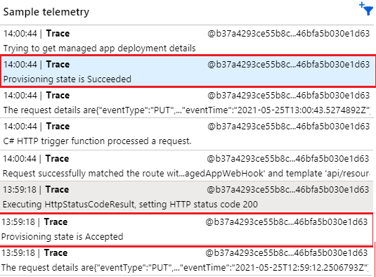
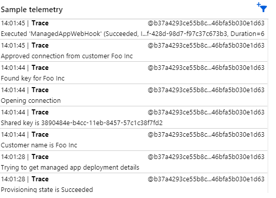

# Application Insights

The Azure Function app uses Application Insights for application monitoring.
To learn more about Application Insights, see https://docs.microsoft.com/en-us/azure/azure-monitor/app/app-insights-overview.

## Live Metrics and Logs

When triggering a deployment, you can monitor live the Azure Function app by going to the Live Metrics blade of Azure Application Insights (https://docs.microsoft.com/en-us/azure/azure-monitor/app/live-stream). This will give you your application traces with 1-second latency.
Alternatively, you can follow the same traces in the Logs as well. You can use the available options to filter based on timestamp, severity level, etc.

On the Sample telemetry for the Live Metrics, you will get traces from your app. Currently, the type of .NET core trace logs used in the app are information and error.
This will help see the progress of the current managed app deployment and debug your Azure Function app.

Some information to look out for:

1. Managed App provisioning state

The managed app provisioning state will tell you the current state of the managed application deployment : Accepted, Suceeded, Failed, etc. (see https://docs.microsoft.com/en-us/azure/azure-resource-manager/managed-applications/publish-notifications#event-triggers)



When you've just triggered a managed app deployment, the provisoning state will be "Accepted". Give it a few seconds and you will see the state changing to "Succeeded", which means your managed app components have now been sucessfully deployed. At this point, your Azure Function app will start the flow for approving your Private endpoint connection.

2. Private endpoint connection approval

The flow for the private endpoint connection approval is as follows:

- Getting managed app deployment details, such as Company Name and pre-shared key. These values were given by the user in the managed app deployment steps.
- Verifying the pre-shared key is valid and can be found in the database.
- Approving private endpoint connection.

Logs in the application insights will show us information about these actions:



## Troubleshooting common errors

```
"You do not have access to get managed app deployment details."
```

This means that the service principal used by the Azure Function app does not have the right access to get deployment details. This implies an error with the role assignment for the service principal at managed app deployment time - it should have been given a Contributor role to the resource group where managed app components are deployed. You can verify it under the access control for the managed resource group.

You can either add this role assignment manually or republish your managed app definition making sure the app.json file contains the right role assignment for this service principal as detailed in [tutorial3](../tutorials/tutorial3.md)

```
"Your shared key is not valid."
```

This can mean that you've made a mistake when you entered the Pre-Shared key at the marketplace deployment time. See [part 3 of the tutorial](../tutorial/part3.md) for how to use the pre-shared key.

Alternatively, this can also mean that you made a mistake when creating a pre-shared key in the database. See [part 1 of the tutorial](../tutorial/part1.md) for how to generate a pre-shared key in the database.


```
The client with object id does not have authorization to perform 'Microsoft.Network/privateLinkServices/privateEndpointConnections/read' over scope '/subscriptions/<subscription-id>/resourceGroups/rg-tutorial/providers/Microsoft.Network/privateLinkServices/fsidemoPrivateLinkService'
```

This means that the service principal used by the Azure Function app does not have Owner role assigned to the resource group where your Private Link Service is deployed, _rg-tutorial_.

Same as in the previous example, you can verify it under the access control for _rg-tutorial_.

To fix this, make sure you add the role assignment as detailed in [part 1 of the tutorial](../tutorial/part1.md).
