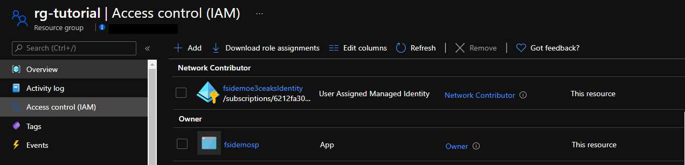

# Part 1: Deploy an Example Function App as a Notification Endpoint

This is part one of a three part tutorial series that will configure and deploy an example of the Private Connectivity pattern.

In later parts, an example Private Link Service will be created using an AKS cluster and internal Load Balancer and a Managed application will be deployed from the service catalog.

## Before you begin

This tutorial assumes a basic understanding of azure cli and Visual Studio Code and Azure Functions.

To support deployment ensure the functions core tools are available ([Function Core Tools](https://docs.microsoft.com/en-us/azure/azure-functions/functions-run-local?tabs=linux%2Ccsharp%2Cbash)) and .Net Core 3.1 SDK is installed ([dotnet core 3.1](https://dotnet.microsoft.com/download/dotnet/3.1)).

To complete this tutorial you will need access to an Azure subscription with the Azure cli configured to use that subscription.

It is recommended to use bash to complete the tutorial either using local command line  i.e. WSL or Azure Cloud Shell

## Get application code

The sample application used in this tutorial is a simple function app consisting of a http trigger to allow interaction with a marketplace deployment.

Use Git to clone the repository to your development and change to the cloned directory.

```
cd Saas-Private-Connectivity
```

In this tutorial, you learn how to:

* Create a resource group
* Deploy the Azure components required to support your function app
* Deploy your function app
* Configure the function app for use with Azure App Insights and Azure MySQL
* Create a database table for use with the example app

## Create a resource group

In Azure, you allocate related resources to a resource group. Create a resource group by using [az group create](/cli/azure/group#az_group_create). The following example creates a resource group named *rg-tutorial* in the *northeurope* location (region).

```
az group create --name rg-tutorial --location northeurope
```

## Deploy Azure components

You will now deploy the components needed to support the notification webhook:

* App Service Plan
* Azure Function app
* Azure MySql
* Storage Account
* Log Analytics
* Application Insights
* Virtual Network (not required directly but will be used in later tutorial)

The templates to deploy these components have been provided as [Bicep](https://github.com/Azure/bicep) templates.  Bicep is a domain-specific language (DSL) that uses declarative syntax to deploy Azure resources.

### Deployment

In the previous step, you created a resource group named "rg-tutorial". In this step you will deploy Azure resources to this resource group.

This tutorial assumes you have Bicep installed. Otherwise, follow the steps in the [Install Bicep](https://docs.microsoft.com/en-us/azure/azure-resource-manager/templates/bicep-install) guide first.

```
cd samples/templates/bicep
az deployment group create -g rg-tutorial -f ./main.bicep
```

You will notice you are asked for an _administratorLoginPassword_. This password will be used to create an administrator password for your MySql instance. Please ensure you pick something that complies with the password policy, which can be found [here](https://docs.microsoft.com/en-us/sql/relational-databases/security/password-policy?view=sql-server-ver15).

Once deployed, get the function name value which can be found in the outputs section from the template deployment. For example:

```json
{
  "outputs": {
     "functionName": {
        "type": "String",
        "value": "fsidemo-2af9-func"
      }
  }
}
```

## Deploy the function

This step assumes you have installed the functions core tools mentioned in the [Before you begin](#before-you-begin) section.

Go back to the repository root directory.

```
cd ../../
```

And navigate to the function app directory.

```
cd samples/ManagedAppWebHook
```

In order to deploy the function, set up some needed environment variables and deploy the app.

```
functionApp=<function name from outputs>

func azure functionapp publish $functionApp
```

The package file will be created and deployed to your function app:


## Check that the function is reachable

Now that the function has been deployed it can be verified using the health url:

```
https://<function-url>/api/health
```

The function URL should be something like: "yourfunctionname.azurewebsites.net".

## Create customer table

Once the function has been deployed you can additionally connect to the Azure MySql using your chosen [connection method](https://docs.microsoft.com/en-us/azure/mysql/how-to-connect-overview-single-server).

Connection can be done using Azure Cloud Shell for example:

```
mysql -h <unique resource name>.mysql.database.azure.com -u <server admin login name> -p
```

The unique resource name and the server admin login name can be obtained from the created resource in the Azure Portal.

As part of this step, you will need to add your IP address under the Connection security blade for Azure MySql. Once there, choose "Add client IP" and enter your IP address (see https://docs.microsoft.com/en-us/azure/mysql/howto-manage-firewall-using-portal#create-a-server-level-firewall-rule-in-the-azure-portal).

When you have connected you will be able to create the required database and table and insert a record.

```
-- Create a database
DROP DATABASE IF EXISTS tutorialdb;
CREATE DATABASE tutorialdb;
USE tutorialdb;

-- Create a table and insert rows
DROP TABLE IF EXISTS customer;
CREATE TABLE customer (id serial PRIMARY KEY, CustomerName VARCHAR(50), SharedKey VARCHAR(50));
```

The tutorial uses a pre-shared key to validate the request for Private Link connection approval. To generate a pre-shared key you will need to create an entry in the customer table.

```
-- insert sample row
INSERT INTO customer ( CustomerName, SharedKey ) VALUES ('ExampleCustomer',uuid());

select * from customer;
```

The result will return a value for the ExampleCustomer and pre-shared key. This pre-shared key will be used in the subsequent steps during this tutorial. NOTE: The CustomerName will need to be the CustomerName entered into the Portal ordering screen in part 3 of this tutorial series.

## Create service principal

To access resources secured by an Azure AD tenant, the function app uses a service principal. There are three types of service principals: "application", "managed identity", and "legacy". This tutorial uses "application" as deployments are cross tenant.  Cross tenant deployments do not support the use of the "managed identity" type.

This principal references a globally unique app object. The service principal object defines what the app can actually do in the specific tenant, who can access the app, and what resources the app can access (see https://learn.microsoft.com/en-us/entra/identity-platform/app-objects-and-service-principals?tabs=browser#service-principal-object).

Choose a service principal name that is unique in your Microsoft Entra ID.

Create your service principal using the following command:

```
az ad sp create-for-rbac --name <SP NAME> --role owner --scope '/subscriptions/<subscriptionId>/resourceGroups/rg-tutorial'
```

The service principal information is displayed as JSON. An example output is shown below:

```
{
  "appId": "414f6051-191f-4786-afa9-b9d1b2cddc31",
  "displayName": "fsidemosp",
  "name": "414f6051-191f-4786-afa9-2d7cd011db47"
  "password": "****************************",
  "tenant": "946ke4ba-15dc-4ca5-9fc8-2d7cd011db47",
}
```

Make note of _clientId_, _clientSecret_ and _tenantId_. You will need this information to update the function application settings.

To test the creation of the service principal, run the following AZ CLI command:

```
az ad sp list --display-name <SP NAME>
```

You can now go to the portal under your access control blade for your resource group and into the role assignments blade. You will see your app listed with an _Owner_ role.



## Update function app settings

One way you can store connection strings and secrets used by your function app and bindings is as application settings. This makes credentials available to both your function code and bindings.

App settings and connection strings are stored encrypted in Azure. They are decrypted only before being injected into your app's process memory when the app starts. The encryption keys are rotated regularly (see https://docs.microsoft.com/en-us/azure/azure-functions/security-concepts#application-settings).

When you develop a function app locally, you must maintain local copies of these values in the _local.settings.json_ project file (see https://docs.microsoft.com/en-us/azure/azure-functions/functions-run-local?tabs=linux%2Ccsharp%2Cbash#local-settings-file).

You can use either the portal or the azure cli to update function app settings.

### Using Azure portal

In order to edit your function app settings, go to the _Configuration_ blade of your function app in the portal and then to _Application Settings_ (see https://docs.microsoft.com/en-us/azure/azure-functions/functions-how-to-use-azure-function-app-settings?tabs=portal#get-started-in-the-azure-portal). You will see some values there by default, such as the *APPINSIGHTS_INSTRUMENTATIONKEY*.

To edit, click on _Advanced Edit_ and this will allow you to edit them as a JSON file. Alternatively click on _New Application Setting_ which will allow you to add one by one.

Once happy with your changes, click on _Save_.

These are the additional app settings needed for your function to run:

```json
{
  "name": "MySqlDatabase",
  "value": "Replace with MySql db name: tutorialdb",
  "slotSetting": false
},
{
  "name": "MySqlPassword",
  "value": "Replace with MySql db administratorLoginPassword",
  "slotSetting": false
},
{
  "name": "MySqlServer",
  "value": "Replace with MySql server name sqlservername.mysql.database.azure.com",
  "slotSetting": false
},
{
  "name": "MySqlUserId",
  "value": "Replace with your MySql user id",
  "slotSetting": false
},
{
  "name": "ResourceGroup",
  "value": "Replace with resource group name: rg-tutorial",
  "slotSetting": false
},
  {
  "name": "AZURE_CLIENT_ID",
  "value": "Replace with Service Principal clientId",
  "slotSetting": false
},
{
  "name": "AZURE_CLIENT_SECRET",
  "value": "Replace with Service Principal clientSecret",
  "slotSetting": false
},
{
  "name": "AZURE_TENANT_ID",
  "value": "Replace with Service Principal tenantId",
  "slotSetting": false
}
```
### Using azure cli

Alternatively, you can update these settings using the azure cli. For example:

```
az functionapp config appsettings set --name fsidemo-3d35-func --resource-group rg-tutorial --settings "MySqlDatabase=tutorialdb"
```

## Next step

Continue to [part 2 of the tutorial](part2.md) to deploy a sample application to the service provider subscription.
