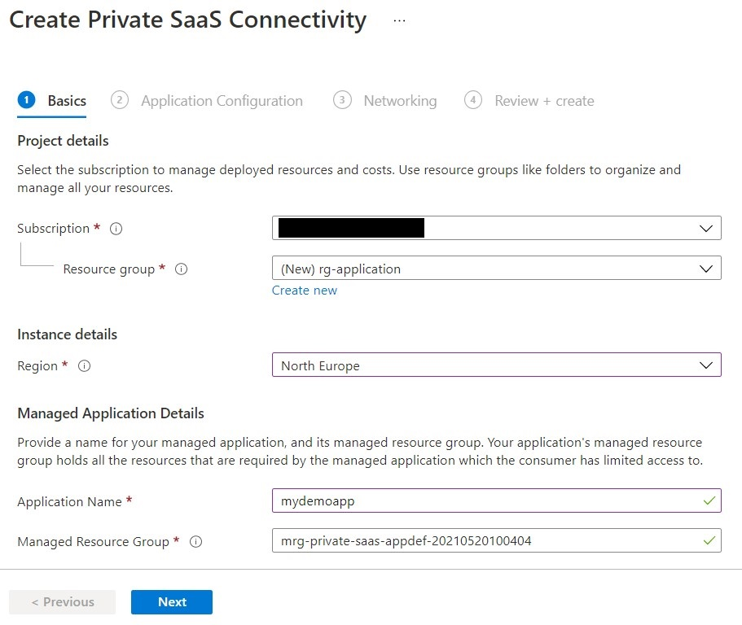
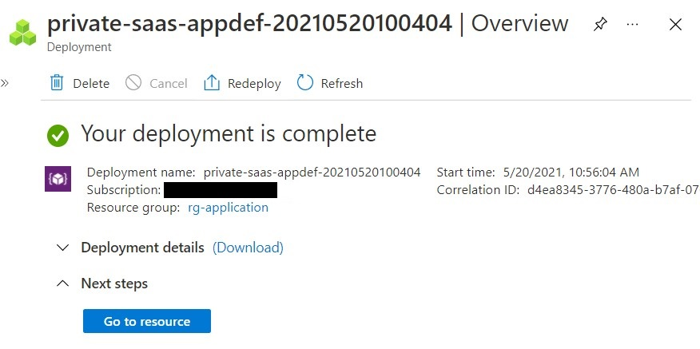
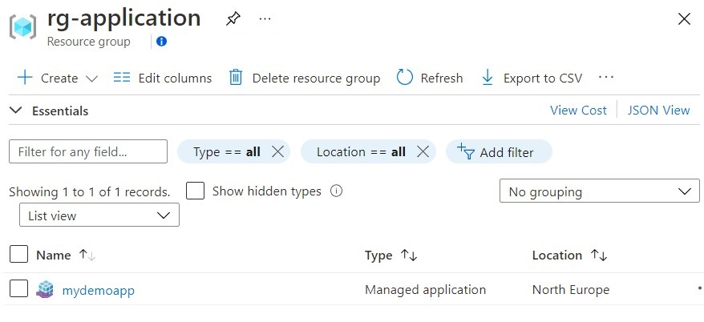
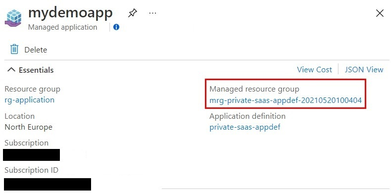
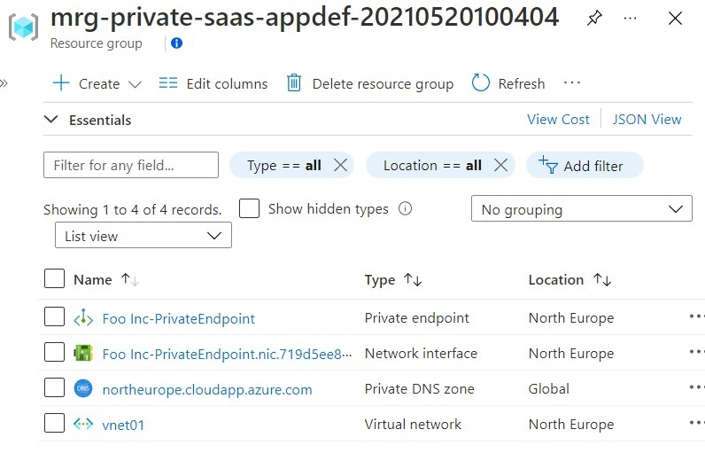
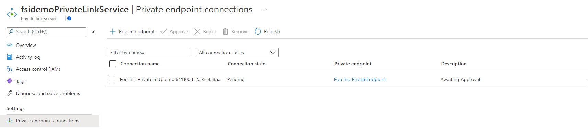
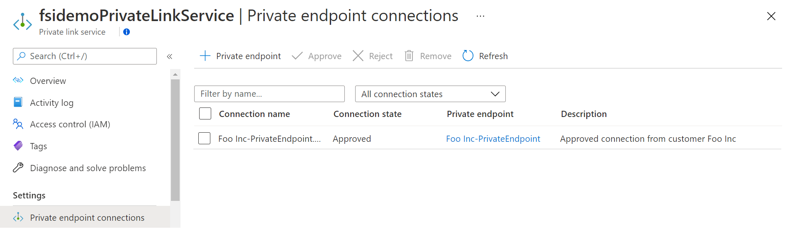

# Part 3: Deploy an Example Managed Application

This is part three of a three part tutorial series that will configure and deploy and example of the Private Connectivity pattern.

The final part of the three part series focuses on the Managed Application deployment and validation of the end to end example scenario ensuring the Private Link connection has been approved as expected and communication with the backend example application is possible using the exposed endpoints.

## Before you begin

This tutorial assumes a basic understanding of Azure CLI.

To complete this tutorial you will need access to an Azure subscription with the Azure CLI configured to use that subscription.

In order to deploy the managed application you will also need to register to use the Microsoft.Solutions resource provider
```
az provider register --namespace "Microsoft.Solutions"
```

## Introduction

In this tutorial, you will learn how to:

* Create a service catalog definition with a notification endpoint configured.
* Deploy the Managed Application from the service catalog definition.
* Validate Private Link connection approval.
* Validate Private Link with connection to example API / endpoint deployed in [part 2](./part2.md).

Details of how a managed application UI definition and deployment template can be created can be found [here](https://docs.microsoft.com/en-us/azure/azure-resource-manager/managed-applications/overview).

## Create a Service Catalog Definition

To publish a managed application to your service catalog, you must:

* Create a template that defines the resources to deploy with the managed application.
* Define the user interface elements for the portal when deploying the managed application.
* Create a _.zip_ package that contains the required template files.
* Decide which user, group, or application needs access to the resource group in the user's subscription.
* Create the managed application definition that points to the _.zip_ package and requests access for the identity.

### Create the managed application template

Every managed application definition includes a file named _mainTemplate.json_. In it, you define the Azure resources to deploy. The template is no different than a regular ARM template.

In our private connectivity context, the template will include a Private Endpoint that will be used by your customers to connect to your private SaaS offering via the Private Link Service we deployed previously.

A sample _mainTemplate.json_ file can be found [here](../../samples/ManagedApp/mainTemplate.json). The template deploys the following Azure resources:

* An optional Virtual Network, depending on if the customer wants to deploy the Private Endpoint to a new Virtual Network or use an existing one.
* A Private DNS Zone and the A Record to override your SaaS endpoint and allow customers to resolve your endpoint to the Private Endpoint IP address instead of the default public IP.
* A Virtual Network Link to enable devices in your Virtual Network to resolve using the Private DNS Zone.
* The Private Endpoint that will connect to your SaaS Private Link Service.

### Create the UI definition

As a publisher, you define the portal experience for creating the managed application. The _createUiDefinition.json_ file generates the portal interface. You define how users provide input for each parameter using [control elements](https://docs.microsoft.com/en-us/azure/azure-resource-manager/managed-applications/create-uidefinition-elements) including drop-downs, text boxes, and password boxes.

A sample _createUiDefinition.json_ file can be found [here](../../samples/ManagedApp/createUiDefinition.json). The file defines a portal experience where customers have to enter their details, a pre-shared key that will be validated on the SaaS side, and the networking details to know where to deploy the Private Endpoint.

You can customize the portal experience to fit your needs and obtain direct information from your customers. To learn more about creating a UI experience, check [this guide](https://docs.microsoft.com/en-us/azure/azure-resource-manager/managed-applications/create-uidefinition-overview).

### Package the files

Add the two files (i.e. _mainTemplate.json_ and _createUiDefinition.json_) to a _.zip_ file named _app.zip_. The two files must be at the root level of the _.zip_ file. If you put them in a folder, you receive an error when creating the managed application definition that states the required files aren't present.

Upload the package to an accessible location from where it can be consumed. Check [this link](https://docs.microsoft.com/en-us/azure/azure-resource-manager/managed-applications/publish-service-catalog-app?tabs=azure-cli#package-the-files) to learn how to publish them to a storage account.

### Create the managed application definition

The next step is to select a user group, user, or application for managing the resources for the customer. This identity has permissions on the managed resource group according to the role that is assigned. The role can be any Azure built-in role like Owner or Contributor.

You need the object ID of the user or group to use for managing the resources and the role definition ID of the Azure built-in role you want to grant access to the user, user group, or application. Typically, you use the Owner or Contributor or Reader role. Check [this guide](https://docs.microsoft.com/en-us/azure/role-based-access-control/built-in-roles) to find the ID of your desired role.

Populate the [_app.json_](../../samples/appdefinition/app.json) file with the following details:

* The type of lock placed on the managed resource group. It prevents the customer from performing undesirable operations on this resource group. Currently, ReadOnly is the only supported lock level.
* One or more authorizations with the user or group object ID, and the role definition ID that are used to grant permission to the managed resource group.
* Your notification endpoint (omit the final _/resource_ of your Function endpoint as it will be automatically appended by the notification engine).
* The location of the _app.zip_ you created earlier (you can use a signed SAS URL if the file is private).

Make sure you add an authorization for the service principal you created in the first part of the tutorial and was configured in the Azure Function that will receive the notifications from the managed application deployment.

Note: In the case of a Marketplace based deployment authorizations are added as "Allowed Control Actions".  In this case roles are added to allow customers ( who have a deny assignment on the managed application resource group by default ) to Peer Vnets and link Private DNS zone to their existing vnets.  These roles are:

|Role|Description|
|--|--|
|Microsoft.Network/virtualNetworks/virtualNetworkPeerings/write|Allow vnet peering to be created|
|Microsoft.Network/virtualNetworks/virtualNetworkPeerings/delete|Allow deletion of vnet peering|
|Microsoft.Network/virtualNetworks/peer/action| Allow peering|
|Microsoft.Network/privateDnsZones/virtualNetworkLinks/write|All private DNS zone to be linked to existing vnet|
|Microsoft.Network/privateDnsZones/virtualNetworkLinks/delete|Allow deletion of Private DNS zone link|
|Microsoft.Network/virtualNetworks/join/action|Allow Private DNS zone control|

<br>
Obtain the object ID for that service principal.

```
az ad sp show --id <YOUR_SERVICE_PRINCIPAL_CLIENT_ID> -o tsv --query "objectId"
```

And add an authorization with _Contributor_ access (role definition ID _b24988ac-6180-42a0-ab88-20f7382dd24c_).

Add an authorization for your logged in user as well. Go to Azure Active Directory and get the Object Id for your user and give it _Contributor_ access (role definition ID b24988ac-6180-42a0-ab88-20f7382dd24c) (See: https://docs.microsoft.com/en-us/azure/active-directory/fundamentals/active-directory-users-profile-azure-portal).
This will allow your current logged in user to make changes to the resource group where the managed application components are deployed.


```json
{
  "properties": {
    ...
    "authorizations": [
      ...
      {
        "principalId": "<YOUR_SERVICE_PRINCIPAL_OBJECT_ID>",
        "roleDefinitionId": "b24988ac-6180-42a0-ab88-20f7382dd24c"
      },
       {
        "principalId": "<YOUR_USER_OBJECT_ID>",
        "roleDefinitionId": "b24988ac-6180-42a0-ab88-20f7382dd24c"
      }
    ],
    ...
}
```

Once populated, you can deploy the application definition with the command below. Make sure to replace the variables with your desired values.

```
SUBSCRIPTION_ID=$(az account show -o tsv --query id)
RESOURCE_GROUP=rg-tutorial
APP_DEF_NAME=unique-name-of-your-app-def
az rest --method put \
    --url "https://management.azure.com/subscriptions/${SUBSCRIPTION_ID}/resourceGroups/${RESOURCE_GROUP}/providers/Microsoft.Solutions/applicationDefinitions/${APP_DEF_NAME}?api-version=2018-06-01" \
    --body @app.json
```

You will see the application definition in your service catalog from the portal.


## Deploy the managed application from service catalog

Now that you have published the managed application definition, you can click on it and deploy the managed app from that definition.


You will be presented with a wizard form where you, as a customer, will have to fill in the information required by the managed application to be deployed.

First, provide values for the **Basics** step. Select the Azure subscription to deploy your service catalog app to. Create a new resource group. Select a location for your app. When finished, select **Next**.



On the next step, **Application Configuration**, customers will type their name, a pre-shared that they would have received by the SaaS provider beforehand and that will be used to validate the deployment and approve the private link service connection, and the remote service alias for the private link service they will be connecting to.

You can obtain the remote service alias from the portal by navigating to the private link service resource, or with the following CLI command.

```
az network private-link-service show -g rg-tutorial -n fsidemoPrivateLinkService -o tsv --query "alias"
```

When finished, select **Next**.


On step 3, **Networking**, you can choose to deploy the managed application to a new Virtual Network and subnet or to an existing one. In this demo we are going to deploy to a new network and subnet.


On the final step, you can review the summary and after validation succeeds, select **Create** to begin deployment.


The managed application will start to deploy and should complete in just a couple of minutes.



After the service catalog app has been deployed, you have two new resource groups. One resource group holds the service catalog app, **rg-application** in this case. The other resource group holds the resources for the service catalog app.

View the resource group named **rg-application** to see the service catalog app.



You can click on the managed application resource and then find the managed resource group that holds the resources for the service catalog app.



Click on the managed resource group to see the resources for the service catalog app.



## Private Link connection approval

While the deployment is in progress, you can go to your Private Link service and you should be seeing in a few seconds a new private endpoint connection:



At the moment, the connection is still pending. Give it another few seconds for the deployment to complete, refresh your private endpoint connections and you will see that the state has changed to approved:



The approval of the private endpoint connection is usually a manual process, unless it is pre-approved when you deploy a Private Link service (see https://docs.microsoft.com/en-us/azure/private-link/private-link-service-overview#control-service-access). In this case, the Azure Function which acts as a notification webhook for your managed app deployment approved the private endpoint connection.

## Validate Private Link connectivity

Deploy an Ubuntu server on the same virtual network where the private endpoint is deployed and connect to your virtual machine using your SSH keys or password.

Install _curl_:

```
sudo apt update && sudo apt upgrade
sudo apt install curl
curl --version
```

Try calling the endpoint exposed via the Private Link service:

```
curl saasprovider.northeurope.cloudapp.azure.com
```

If the private connection between your private endpoint and your private link service was successfully established, you will get the following :


