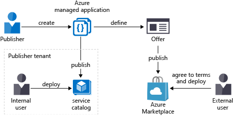

# Private Connectivity - Service Catalog

Outlined below are detailed of how the Azure Serivce Catalog can be used to deploy the private connectivity pattern.  Service Catalog based deployments are only available to be deployed by internal users as the service catalog is an internal catalog of approved solutions for users in an organization.

## Service Catalog Set-up

Details of how to create and Publish the Service Catalog Managed Application definition can be found [here](https://docs.microsoft.com/en-gb/azure/azure-resource-manager/managed-applications/publish-service-catalog-app?tabs=azure-powershell)

In order to create a Service Catalog definition ( the definition is what a user deploys from ) the following elements will be required
- customUIDefinition.json  ( defines the Users UI portal experience )
- mainTemplate.json  ( ARM template defintion of the resources to deploy )

In addition when the service catalog definition is created authorization details ( users or AD group ) and details of the notification webhook (if used) will be required.

### Service Catalog for Private Connectivity Pattern

#### CustomUIDefinition

The CustomUIDefinition will contain details of the fields and information that needs to be captured from the end user are "ordering" time.  For the private connectity pattern, as a minimum this would contain the resource group to which the managed application will be deployed and details of the virtual network configuration required, either existing or new vnet.