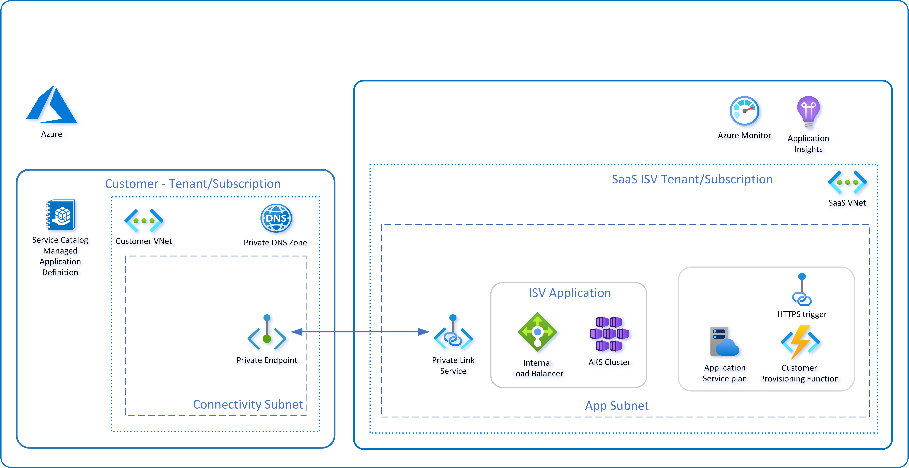

# Private Connectivity Pattern - Tutorials

The tutorials are designed to provide and example deployment that demonstrated the private connectivity pattern, automated authorization of the Private Link Connection based on a preShared Key using a notification Webhook and Identity to interact with the Managed Application deployment.  In this example an Azure Function App has been used to support the WebHook, the example of which can be found in the [repo](../../tutorials/ManagedAppWebHook/).

The tutorial architecture is shown below

The deployment includes the deployment of an Azure MySQL DB for storing a SharedKey and Azure Kubernetes Service for hosting the example application which will be used to validate the private link connection is working correctly.

## Next steps

Deploy the Notification webhook and Azure Infrastructure required for the tutorials [tutorial1.md](./tutorials/tutorial1.md)