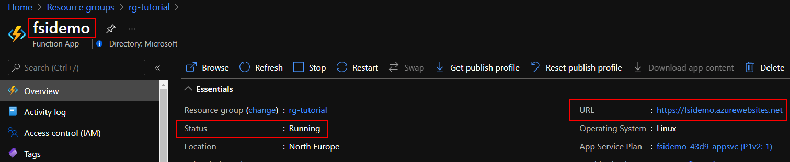
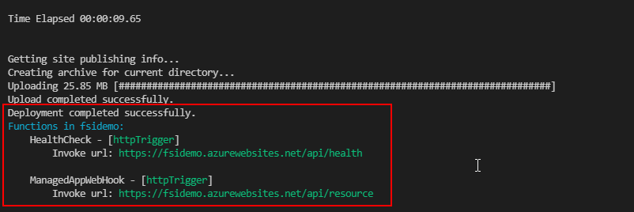

# Tutorial: Deploy an Example Function App as a Notification Endpoint

This tutorial is part one of a three part tutorial series that will configure and deploy an example of the Private Connectivity pattern.

In later tutorials, an example Private Link Service will be created using an AKS cluster and internal Load Balancer and a Managed application will be deployed from the Service Catalog.

## Before you begin

This tutorial assumes a basic understanding of azure cli and Visual Studio Code and Azure Functions

To support deployment ensure the functions core tools are available [Core Tool](https://docs.microsoft.com/en-us/azure/azure-functions/functions-run-local?tabs=linux%2Ccsharp%2Cbash) and dotnet sdks are installed [dotnet](https://docs.microsoft.com/en-gb/dotnet/core/install/)

To complete this tutorial you will need access to an Azure subscription with the Azure cli configured to use that subscription and have the appropriate dotnet SDK installed. This tutorial project was developed using .NET 5, so either .NET Core 3.1 or .NET 5 sdk is required."


## Get application code

The [sample function app][sample-application] used in this tutorial is a simple function app consisting of a http trigger to allow interaction with a marketplace deployment.

Use git to clone the sample application to your development environment:

```
git clone https://github.com/Azure/SaaS-Private-Connectivity.git

```

Change into the cloned directory.

```
cd tutorials

```

In this tutorial, you learn how to:

* Create a resource group 
* Deploy the Azure components required to support your Function App
* Deploy your Function App
* Configure the Function App for use with Azure App Insights and Azure MySQL 
* Create a database table using MySQL Workbench for use with the example app


## Create a resource group

In Azure, you allocate related resources to a resource group. Create a resource group by using [az group create](/cli/azure/group#az_group_create). The following example creates a resource group named *demoResourceGroup* in the *northeurope* location (region). 

```
az group create --name rg-tutorial --location northeurope

```

## Deploy needed Azure Components

You'll now deploy the components needed to support the Notification Webhook.

- App Service Plan
- Azure MySql
- Storage Account
- Log Analytics
- Application Insights
- Virtual Network (not required directly but will be used in later tutorial)

The templates to deploy these components have been provided as an ARM template or Bicep templates


### Bicep deployment

This tutorial assumes you have bicep installed [bicep](https://docs.microsoft.com/en-us/azure/azure-resource-manager/templates/bicep-install?tabs=azure-powershell)

```
cd /templates/bicep

az deployment group create -g rg-tutorial -f ./main.bicep

```

Once deployed there are some values that will be required in subsequent steps which can be found in the outputs from the template deployments for example:

```
    "outputs": {
      "appSvcResourceId": {
        "type": "String",
        "value": "/subscriptions/<subscriptionId>/resourceGroups/rg-tutorial/providers/Microsoft.Web/serverfarms/fsidemo-88dc-appsvc"
      },
      "insightsKey": {
        "type": "String",
        "value": "<key value>"
      },
      "insightsName": {
        "type": "String",
        "value": "fsidemo-88dc-insights"
      },
      "resourceGroup": {
        "type": "String",
        "value": "rg-tutorial"
      },
      "storageAccountName": {
        "type": "String",
        "value": "fsidemo88dcsa"
      }

```


## Deploy the Function App
The Function App will be deployed to the App Service Plan created in the last step.  The http trigger based function to listen for webhook notifications will then be deployed to this function app.

```
cd /Tutorial/ManagedAppWebHook

```
In order to deploy the function app use the following:

```
resourceGroup=<resouregroup from outputs>
storageAccount=<storageAccount Name from outputs>
plan=<appSvcResourceId from outputs>
insights=<insightsName from outputs>
functionApp=fsidemo

az functionapp create --name $functionApp -g $resourceGroup -s $storageAccount --app-insights $insights --os-type Linux --runtime dotnet --plan $plan --functions-version 3

```
The function app will be created and can be viewed in the Azure portal 




Deploy the function

```
func azure functionapp publish $functionApp


```

The package file will be created and deployed to your function app:




## Check that the function is reachable

Now that the Function has been deployed it can be verified using the health url 

```
https://<azure website host>/api/health
```

Once the function has been deployed you can additionally connect to the Azure MySql using your chosen [connection method](https://docs.microsoft.com/en-us/azure/mysql/how-to-connect-overview-single-server)

When you have connected you will be able to create the required database and table and insert a record.

## Create customer table

```
-- Create a database
DROP DATABASE IF EXISTS tutorialdb;
CREATE DATABASE tutorialdb;
USE tutorialdb;

-- Create a table and insert rows
DROP TABLE IF EXISTS customer;
CREATE TABLE customer (id serial PRIMARY KEY, CompanyName VARCHAR(50), SharedKey VARCHAR(50));
```

The tutorial uses a SharedKey to validate the request for private link connection approval. To generate a SharedKey you will need to create an entry in the customer table

```
-- insert sample row
INSERT INTO customer ( CompanyName, SharedKey ) VALUES ('ExampleCustomer',uuid());

select * from customer;
```

The result will return a value for the ExampleCustomer and SharedKey.  This SharedKey can be used in the subsequent steps in [tutorial3](./tutorial3.md)


## Create service principal

To access resources secured by an Azure AD tenant, the function app uses a service principal. There are 3 types of Service principal: application, managed identity and legacy - this tutorial uses application.
This principal is created in each of the tenants (publisher and consumer) and references the globally unique app object. The service principal object defines what the app can actually do in the specific tenant, who can access the app, and what resources the app can access. (https://docs.microsoft.com/en-us/azure/active-directory/develop/app-objects-and-service-principals#service-principal-object) 

Login to your Azure subscription and create your service principal using the following command (https://docs.microsoft.com/en-us/dotnet/azure/authentication):

```
az ad sp create-for-rbac --sdk-auth
```

The service principal information is displayed as JSON.

```
{
  "clientId": "b52dd125-9272-4b21-9862-0be667bdf6dc",
  "clientSecret": "ebc6e170-72b2-4b6f-9de2-99410964d2d0",
  "subscriptionId": "ffa52f27-be12-4cad-b1ea-c2c241b6cceb",
  "tenantId": "72f988bf-86f1-41af-91ab-2d7cd011db47",
  "activeDirectoryEndpointUrl": "https://login.microsoftonline.com",
  "resourceManagerEndpointUrl": "https://management.azure.com/",
  "activeDirectoryGraphResourceId": "https://graph.windows.net/",
  "sqlManagementEndpointUrl": "https://management.core.windows.net:8443/",
  "galleryEndpointUrl": "https://gallery.azure.com/",
  "managementEndpointUrl": "https://management.core.windows.net/"
}
```

Make note of clientId,clientSecret and tenantId - you will need this information to update the Function application settings. 

A service principal will be created in the consumer tenant as well, but this time as part of the marketplace offering creation. (see tutorial..(UPDATE HERE))
This service principal will be used in the function app to get details of the marketplace deployment in the consumer subscription, such as the typed in Shared key or Customer name.

## Update Function App Settings

One way you can store connection strings and secrets used by your function app and bindings is as application settings. This makes credentials available to both your function code and bindings.
App settings and connection strings are stored encrypted in Azure. They're decrypted only before being injected into your app's process memory when the app starts. The encryption keys are rotated regularly. (https://docs.microsoft.com/en-us/azure/azure-functions/security-concepts#application-settings)

When you develop a function app locally, you must maintain local copies of these values in the local.settings.json project file. (https://docs.microsoft.com/en-us/azure/azure-functions/functions-run-local?tabs=linux%2Ccsharp%2Cbash#local-settings-file)

In order to edit your function app settings, go to the Configuration blade of your function app in the portal and then to AppSettings (https://docs.microsoft.com/en-us/azure/azure-functions/functions-how-to-use-azure-function-app-settings?tabs=portal#get-started-in-the-azure-portal). You will see some values there by default, such as the APPINSIGHTS_INSTRUMENTATIONKEY, APPLICATIONINSIGHTS_CONNECTION_STRING, etc.

To edit, click on Advanced Edit and this will allow you to edit them as a JSON file. Alternatively click on New application setting which will allow you to add one by one.
Once happy with your changes, click on Save.

These are the additional app settings needed for your function to run :

```
  {
    "name": "ClientId",
    "value": Replace with Service Principal clientId,
    "slotSetting": false
  },
  {
    "name": "ClientSecret",
    "value": Replace with Service Principal clientSecret,
    "slotSetting": false
  },
  {
    "name": "TenantId",
    "value": Replace with Service Principal tenantId,
    "slotSetting": false
  },
  {
    "name": "MySqlDatabase",
    "value": Replace with Sql database name,in this case tutorialdb,
    "slotSetting": false
  },
  {
    "name": "MySqlPassword",
    "value": Replace with Sql db password,
    "slotSetting": false
  },
  {
    "name": "MySqlServer",
    "value": Replace with sql server name sqlservername.mysql.database.azure.com,
    "slotSetting": false
  },
  {
    "name": "MySqlUserId",
    "value": Replace with your Sql user id,
    "slotSetting": false
  },
  {
    "name": "PrivateLinkService",
    "value": Replace with private link service name,
    "slotSetting": false
  },
  {
    "name": "ResourceGroup",
    "value": Replace with resource group name where private link service is deployed,
    "slotSetting": false
  },
    {
    "name": "AZURE_CLIENT_ID",
    "value": Replace with Service Principal clientId,
    "slotSetting": false
  },
  {
    "name": "AZURE_CLIENT_SECRET",
    "value":  Replace with Service Principal clientSecret,
    "slotSetting": false
  },
  {
    "name": "AZURE_TENANT_ID",
    "value":  Replace with Service Principal tenantId,
    "slotSetting": false
  },
```

The following values : AZURE_CLIENT_ID, AZURE_CLIENT_SECRET and AZURE_TENANT_ID are used by Azure Default Credentials (https://docs.microsoft.com/en-us/dotnet/api/overview/azure/identity-readme#defaultazurecredential). These are used to authenticate in the publisher tenant.

## Next steps

Deploy a sample application [Tutorial2](./tutorial-sampleapp.md)