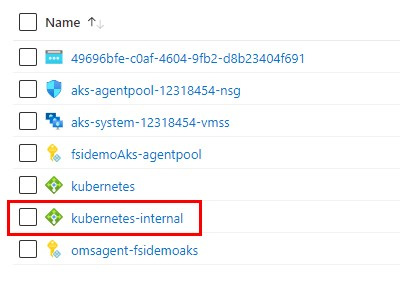

# Tutorial 2: Deploy an Example Application and Private Link Service

This tutorial is part two of a three part tutorial series that will configure and deploy and example of the Private Connectivity pattern.


## Before you begin

This tutorial assumes a basic understanding of azure cli and Visual Studio Code and Azure Functions

To complete this tutorial you will need access to an Azure subscription with the Azure cli configured to use that subscription and have the appropriate dotnet SDK installed.

In this tutorial, you learn how to:

* Deploy a simple application
* Retrieve details of the internal load balancer
* Create a Private Link Service for the example application

## Deploy a simple application

We will deploy an application that will be used as an example of a privately-offered application or application apis. The example application is just a Hello-World example, but this can be replaced by a more complex application. As well as deploying the application, we will also expose the application with a Load Balancer service however, you could also use an Ingress resource and any supported ingress (e.g. Nginx). Check the docs for [creating an ingress controller to an internal load balancer](https://docs.microsoft.com/en-us/azure/aks/ingress-internal-ip).

Update your Kubectl config with the AKS cluster credentials.

```
az aks get-credentials --resource-group rg-tutorial --name fsidemoAks
```

Deploy the application.

```
kubectl create -f tutorials/templates/app
```

The application pod should become ready in just a few seconds.

```
kubectl get deploy
NAME                 READY   UP-TO-DATE   AVAILABLE   AGE
aks-helloworld-one   1/1     1            1           1m
```

## Retrieve details of the internal load balancer

Retrieve the details of the loadbalancer that was created using:

```
kubectl get services
```

The external IP address will correspond to the internal load balancer IP address. The address will take some time to be populated as the load balancer is being created on demand.

```
NAME                 TYPE           CLUSTER-IP     EXTERNAL-IP   PORT(S)        AGE
aks-helloworld-one   LoadBalancer   10.2.170.194   <pending>     80:30154/TCP   1m

```

However, after a few minutes, you should expected to find the external IP address.

```
NAME                 TYPE           CLUSTER-IP     EXTERNAL-IP   PORT(S)        AGE
aks-helloworld-one   LoadBalancer   10.2.170.194   10.0.0.97     80:30154/TCP   10m

```

If the service external IP does not show up after a few minutes check the service events to see if there is any error in the creation of the load balancer.

```
kubectl describe service aks-helloworld-one
```

The load balancer creation could temporarily fail due to the propagation of permissions to the AKS identity over the virtual network. This should resolve automatically after a few more minutes.

```
Name:                     aks-helloworld-one
...
Events:
  Type     Reason                  Age                From                Message
  ----     ------                  ----               ----                -------
  Normal   EnsuringLoadBalancer    21s (x4 over 56s)  service-controller  Ensuring load balancer
  Warning  SyncLoadBalancerFailed  21s (x4 over 56s)  service-controller  Error syncing load balancer: failed to ensure load balancer: Retriable: false, RetryAfter: 0s, HTTPStatusCode: 403, RawError: Retriable: false, RetryAfter: 0s, HTTPStatusCode: 403...
```

Another way to validate the creation of the internal load balancer is by navigating to the AKS-managed resource group (i.e. "rg-tutorial-aks") and checking for the loadbalancer named "kubernetes-internal".



Now that the load balancer is up and running, obtain the frontend IP configuration ID and save it into a variable that will be used later to create the private link service.

```
FRONTEND_ID=$(az network lb show -g rg-tutorial-aks -n kubernetes-internal --query "frontendIpConfigurations[0].id" -o tsv)
```

## Create a Private Link Service

Before creating the Private Link Service we need to disable the private link service network policies.

```
az network vnet subnet update -g rg-tutorial --vnet-name fsidemo-a59d-vnet --name app-subnet  --disable-private-link-service-network-policies true
```

Also obtain the subnet ID that will host the private link service.

```
SUBNET_ID=$(az network vnet subnet show -g rg-tutorial --vnet-name fsidemo-a59d-vnet --name app-subnet --query "id" -o tsv)
```

Create the Private Link Service.

```
az network private-link-service create -g rg-tutorial -n fsidemoPrivateLinkService --lb-frontend-ip-configs $FRONTEND_ID --subnet $SUBNET_ID
```

## Next steps

Deploy a Managed Application [Tutorial3](./tutorial3.md)