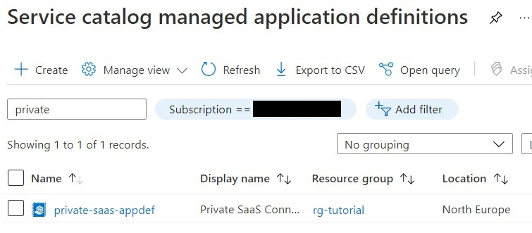

# Tutorial: Deploy an Example Managed Application

This tutorial is part three of a three part tutorial series that will configure and deploy and example of the Private Connectivity pattern.

The final part of the three part series focuses on the managed Application deployment and validation of the end to end example scenario ensuring the Private Link connection has been approved as expected and communication with the backend example application is possible using the exposed endpoints

## Before you begin

This tutorial assumes a basic understanding of Azure CLI.

To complete this tutorial you will need access to an Azure subscription with the Azure CLI configured to use that subscription.

## Introduction

In this tutorial, you learn how to:

* Create a Service Catalog Definition with a Notification Endpoint configured
* Deploy the managed Application from the Service Catalog definition
* Validate Private Link connection approval
* Validate Private Link with connection to example api / endpoint deployed in [tutorial2](./tutorial2.md)

Details of how a managed application UI definition and deployment template can be created can be found [here](https://docs.microsoft.com/en-us/azure/azure-resource-manager/managed-applications/overview)

## Create a Service Catalog Definition

To publish a managed application to your service catalog, you must:

* Create a template that defines the resources to deploy with the managed application.
* Define the user interface elements for the portal when deploying the managed application.
* Create a _.zip_ package that contains the required template files.
* Decide which user, group, or application needs access to the resource group in the user's subscription.
* Create the managed application definition that points to the _.zip_ package and requests access for the identity.

### Create the managed application template

Every managed application definition includes a file named _mainTemplate.json_. In it, you define the Azure resources to deploy. The template is no different than a regular ARM template.

In our private connectivity context, the template will include a Private Endpoint that will be used by your customers to connect to your private SaaS offering via the Private Link Service we deployed previously.

A sample _mainTemplate.json_ file can be found [here](../../tutorials/ManagedApp/mainTemplate.json). The template deploys the following Azure resources:

* An optional Virtual Network, depending on if the customer wants to deploy the Private Endpoint to a new Virtual Network or use an existing one.
* A Private DNS Zone and the A Record to override your SaaS endpoint and allow customers to resolve your endpoint to the Private Endpoint IP address instead of the default public IP.
* A Virtual Network Link to enable devices in your Virtual Network to resolve using the Private DNS Zone.
* The Private Endpoint that will connect to your SaaS Private Link Service.

### Create the UI definition

As a publisher, you define the portal experience for creating the managed application. The _createUiDefinition.json_ file generates the portal interface. You define how users provide input for each parameter using [control elements](https://docs.microsoft.com/en-us/azure/azure-resource-manager/managed-applications/create-uidefinition-elements) including drop-downs, text boxes, and password boxes.

A sample _createUiDefinition.json_ file can be found [here](../../tutorials/ManagedApp/createUiDefinition.json). The file defines a portal experience where customers have to enter their details, a pre-shared key that will be validated on the SaaS side, and the networking details to know where to deploy the Private Endpoint.

You can customize the portal experience to fit your needs and obtain direct information from your customers. To learn more about creating a UI experience, check [this guide](https://docs.microsoft.com/en-us/azure/azure-resource-manager/managed-applications/create-uidefinition-overview).

### Package the files

Add the two files (i.e. _mainTemplate.json_ and _createUiDefinition.json_) to a _.zip_ file named _app.zip_. The two files must be at the root level of the _.zip_ file. If you put them in a folder, you receive an error when creating the managed application definition that states the required files aren't present.

Upload the package to an accessible location from where it can be consumed. Check [this link](https://docs.microsoft.com/en-us/azure/azure-resource-manager/managed-applications/publish-service-catalog-app?tabs=azure-cli#package-the-files) to learn how to publish them to a storage account.

### Create the managed application definition

The next step is to select a user group, user, or application for managing the resources for the customer. This identity has permissions on the managed resource group according to the role that is assigned. The role can be any Azure built-in role like Owner or Contributor.

You need the object ID of the user or group to use for managing the resources and the role definition ID of the Azure built-in role you want to grant access to the user, user group, or application. Typically, you use the Owner or Contributor or Reader role. Check [this guide](https://docs.microsoft.com/en-us/azure/role-based-access-control/built-in-roles) to find the ID of your desired role.

Populate the [_app.json_](../../tutorials/appdefinition/app.json) file with the following details:

* The type of lock placed on the managed resource group. It prevents the customer from performing undesirable operations on this resource group. Currently, ReadOnly is the only supported lock level.
* One or more authorizations with the user or group object ID, and the role definition ID that are used to grant permission to the managed resource group.
* Your notification endpoint (omit the final _/resource_ of your Function endpoint as it will be automatically appended by the notification engine).
* The location of the _app.zip_ you created earlier (you can use a signed SAS URL if the file is private).

Once populated, you can deploy the application definition with the command below. Make sure to replace the variables with your desired values.

```
SUBSCRIPTION_ID=$(az account show -o tsv --query id)
RESOURCE_GROUP=rg-tutorial
APP_DEF_NAME=unique-name-of-your-app-def
az rest --method put \
    --url https://management.azure.com/subscriptions/${SUBSCRIPTION_ID}/resourceGroups/${RESOURCE_GROUP}/providers/Microsoft.Solutions/applicationDefinitions/${APP_DEF_NAME}\?api-version\=2018-06-01 \
    --body @app.json
```

You will see the application definition in your Service Catalog from the portal.


